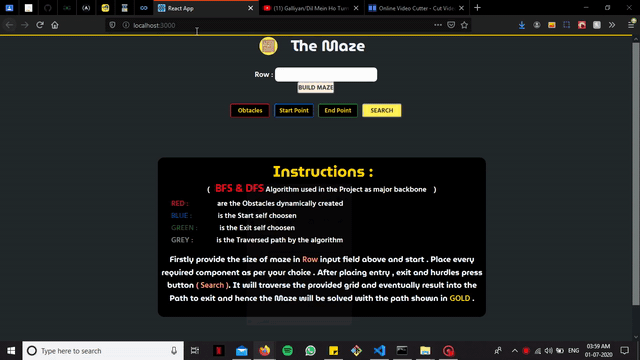

## MAZE-RUNNER

<table>
  <tr>
    <td></td>
    <td> This is the glimpes of the project .  
   It is developed using <b>react js</b> ,  which is a library of a <b>js</b> (javascript) .
   <b>EXTRA PACKAGES USED ARE :</b>
   <ul>
   <b><li>Radium</li></b>
   <b><li>ReactBootstrap</li></b>
   <b><li>Google Fonts</li></b>  
   </ul>
    
   If you are into programming then you will surely like the
   implementation of Graph Theory in practical use . 
    </td>
  </tr>
</table>
